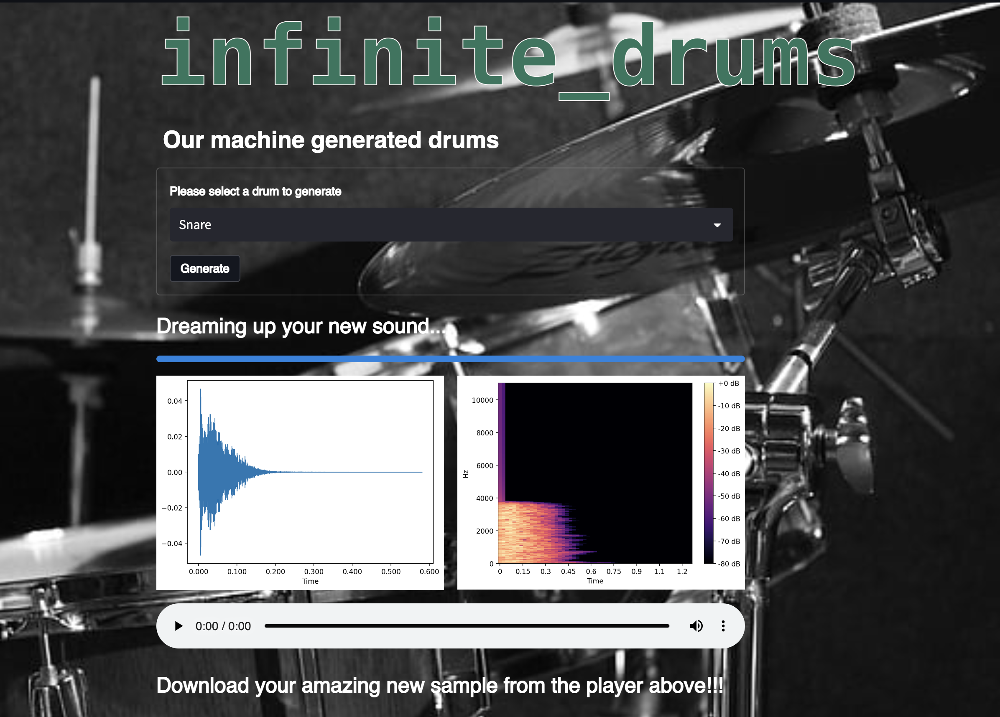

# [INFINITE DRUMS](https://charlieelwess-infinite-drums-front-endapp-24kagw.streamlit.app/)

Generating infinite one-shot drum samples using a variational auto-encoder model (VAE).

[Check out the app and generate your own sounds](https://charlieelwess-infinite-drums-front-endapp-24kagw.streamlit.app/)

## [Project](https://github.com/CharlieElwess/INFINITE_DRUMS#project)

Using a personal collection of drum recordings as input data, a VAE was trained to reproduce the input sounds following compression to a lower-dimensional latent space. Once the model was trained, entirely novel samples could be created by sampling from this latent space and passing the output through the decoder side of the model.

## [Features](https://github.com/CharlieElwess/INFINITE_DRUMS#features)

-   Select your preferred drum type.
-   Visualize the waveform and spectrogram of your generated sound.
-   Play the sound.
-   Download sounds in WAV format for use in your productions.
-   Keep generating until you find the perfect sound.

## Process

- Standardization of input samples using iZotope RX: re-sampling to 48kHz, peak normalization, dithering to 24 bit depth.
- Conversion of audio files into Numpy arrays of equal length.
- Ensure the dropping of any NaN values.
- Training the VAE on the pre-processed data and measuring Binary Cross-entropy loss.
- Sampling from latent space.
- Post-processing, including spectrogram-to-audio conversion using Griffin-Lim.

## Team

- Charlie Elwess
- Choe Guiver
- Felix Morrison
- Henry Triggs

## Additional Info.

This was a final project for the Le Wagon London Data Science Bootcamp #1050 in December 2022.
